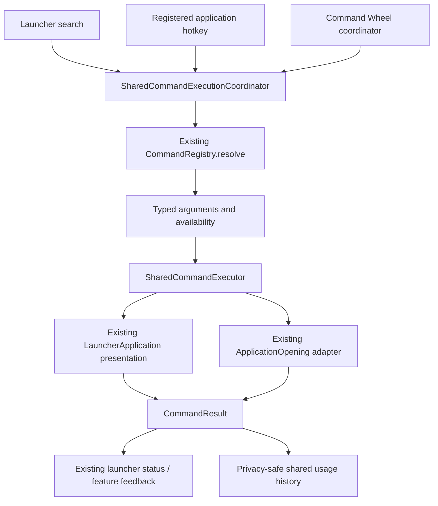
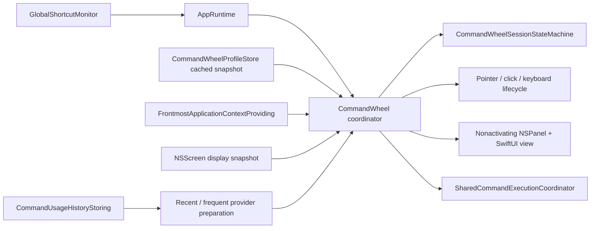

# Command Wheel Architecture

Command Wheel is an app-target presentation and interaction feature. It owns radial layout,
profiles, input sessions, and an AppKit panel; it does not own command behavior. Its actionable
segments are persistable `CommandReference` values resolved and executed by the same shared path as
launcher search and application hotkeys.

## Repository audit and resulting boundaries

The pre-implementation audit found these ownership seams:

| Concern | Existing owner / decision |
|---|---|
| Command model | `CommandID`, `CommandManifest`, and descriptors in CommandKit |
| Command registry | The existing `CommandRegistry` actor in CommandKit |
| Command search | `CommandSearchProvider` over registered manifests |
| Command executor | Previously a protocol without a production implementation; now the shared app execution path described below |
| Command result | `CommandResult` in CommandKit |
| Registered feature implementation | `LauncherApplicationRegistry` and `LauncherApplication` sessions |
| Installed-app opening | `ApplicationOpening`, implemented by `WorkspaceApplicationOpener` |
| File and URL behavior | Existing feature services behind Infrastructure protocols; not copied into the wheel |
| Workflows and plugins | Contracts or future work only; Command Wheel does not claim executable support |
| Permission management | Existing `PermissionServicing` and feature-specific permission-aware adapters |
| Global shortcuts | Carbon hot-key adapters; consolidated into one press/release owner for runtime use |
| Settings | Existing typed Settings shell plus focused feature model/store |
| Complex persistence | Actor-backed versioned atomic JSON precedent in Application Support |
| Dependency assembly | `AppBootstrapper`, `AppDependencies`, `AppContainer`, and `AppRuntime` |
| Windowing | Accessory app with active-Space AppKit/SwiftUI window coordination |
| Logging | `AppLogger` / Observability with privacy restrictions |
| Documentation | Repository Markdown plus typed in-app core articles |
| Tests | CommandKit package tests, `CommandlyTests`, and `CommandlyUITests` |

The application registry remains the owner of registered feature implementations and settings. It
is not a second command resolver: all known launchable manifests, including disabled ones, are
atomically synchronized into the existing CommandKit registry with one availability snapshot, and
every invocation resolves there before execution.

## Shared execution flow



`SharedCommandExecutionCoordinator` is an actor. For one request it:

1. Refreshes the catalog atomically when composition supplied a synchronizer.
2. Resolves the saved `CommandReference` with `CommandRegistry`.
3. Rejects an unavailable result or invalid typed arguments.
4. Calls `SharedCommandExecutor` exactly once.
5. Records command ID, invocation source, outcome, record ID, and timestamp only.
6. Returns the existing `CommandResult` or a sanitized typed coordinator error.

`SharedCommandExecutor` contains app-level reusable behavior, not wheel behavior. Registered
Commandly commands cross a narrow main-actor presentation boundary into the existing
`LauncherApplicationRegistry` implementation. Installed application results use the parameterized
`applications.open-installed` manifest and its `bundleIdentifier` string argument, then call the
existing `ApplicationOpening` adapter. Search and wheel references therefore reach the same opener
and usage-ranking update.

Permission checks remain with the command implementation that already owns them. A permission-aware
feature can return its existing result or present its existing recovery path; the wheel does not
replicate the check.

### Availability snapshots

`ProductionCommandAvailabilityEvaluator` captures one immutable generation containing known
manifests, command-level availability, and the normalized bundle identifiers discovered by the
existing installed-application query. Disabled registered applications remain known with a
`.disabled` reason. Commands declare non-secret permission requirements in their shared manifest;
the evaluator checks the existing permission service without prompting and records a
`.missingPermission` reason. The parameterized installed-application manifest is evaluated against
the bundle identifier in each saved reference, so uninstalling one application does not disable
other application references.

The same snapshot is installed atomically in `CommandRegistry` and supplied to Command Wheel
Settings. Settings therefore distinguishes a removed command from a known but unavailable command,
and `SharedCommandExecutionCoordinator` rejects the exact same disabled, denied-permission, or
uninstalled reference before its executor runs. Snapshot evaluation plus registry publication is
serialized by a coalescing refresh actor: requests admitted while one pass awaits force exactly one
newer pass, and no successful caller resumes until that newer generation is published. The Settings
model independently rejects a provider result when a later refresh generation has already started.

## Persisted command references

CommandKit supplies Codable, Hashable, Sendable values:

```swift
CommandReference(
    commandID: CommandID(rawValue: "applications.open-installed"),
    arguments: CommandArguments([
        "bundleIdentifier": .string("com.example.Application")
    ])
)
```

`CommandArgument` declares requiredness, value type, and an optional default. Registry resolution
rejects unknown names, missing required values, duplicate schema names, and mismatched value types.
Supported serialized values are strings, booleans, integers, decimals, URLs, and string lists.

Arguments must not contain credentials. They are persisted only when a command's shared schema
defines a safe reusable argument. Arguments are never copied into usage history or logs.

## Runtime feature graph



AppRuntime composes one long-lived profile store, global shortcut owner, wheel coordinator, shared
command coordinator, context provider, and history store. Settings observes the same profile store;
it does not create a competing runtime configuration.

## Session state machine

Every activation receives a UUID plus monotonically increasing generation. Asynchronous provider
or presentation work must present that token before it can update state.

```mermaid
stateDiagram-v2
    [*] --> idle
    idle --> preparing: accepted key-down / toggle
    preparing --> presenting: profile, context, providers, display ready
    presenting --> tracking: panel ordered front
    tracking --> transitioning: submenu threshold / dwell / activate
    transitioning --> tracking: child or parent page ready
    tracking --> executing: release, click, or Return with selection
    preparing --> dismissing: cancel or context loss
    presenting --> dismissing: cancel or display/context change
    tracking --> dismissing: center, Escape, outside click
    transitioning --> dismissing: cancel
    executing --> dismissing: request accepted / result
    preparing --> failed: preparation error
    presenting --> failed: panel error
    tracking --> failed: provider or context error
    transitioning --> failed: invalid page transition
    failed --> dismissing
    dismissing --> idle: logical session detached; panel fade may finish
```



The machine rejects repeated key-down, repeated key-up, duplicate execution, stale async work, and
invalid transitions. Provider tasks are owned by the active token and cancelled on page transition,
execution, failure, dismissal, shortcut replacement, display/context change, or termination.

A Hold-and-Release key-up received during asynchronous preparation is retained as one pending final
pointer location for that session token. Once preparation freezes the page, the coordinator resolves
that sample immediately and either dispatches exactly once or cancels; it never presents a wheel
after the user has already released the shortcut. Before either presentation or pending-release
execution, the coordinator revalidates the captured frontmost process and complete display snapshot.

## Selection geometry and hysteresis

Pure geometry uses AppKit global coordinates: origin at the primary display's lower-left, positive
Y upward. Slot zero is centered at the top and indices increase clockwise.

For center `c` and pointer `p`:

```text
dx = p.x - c.x
dy = p.y - c.y
clockwiseFromTop = atan2(dx, dy)
relativeAngle = normalize(clockwiseFromTop - startAngle)
slot = floor((relativeAngle + degreesPerSlot / 2) / degreesPerSlot) mod slotCount
```

The swapped `atan2` arguments deliberately make zero point upward and positive angles clockwise.
An exact clockwise boundary belongs to the following slot, which makes boundary behavior stable and
testable.

Radial regions are dead zone, neutral ring, selection ring, and submenu activation. Dead, neutral,
and empty-slot samples clear selection immediately so release cannot execute the last highlight.
Angular hysteresis requires entry beyond the adjacent boundary before switching. Minimum movement
rejects noise, while the final key-up sample bypasses movement and hysteresis so a fast flick uses
the true release direction.

Rendering animation state never participates in hit testing.

## Multi-display positioning

`NSScreen` objects are converted once into immutable snapshots containing stable process-local
identifier, frame, visible frame, and scale. Pure positioning supports:

- cursor placement;
- active display center;
- a fixed point normalized to a display's usable frame.

Display lookup handles inclusive shared edges, display gaps, negative origins, differing scales,
and missing preferred displays with deterministic distance and lexical tie-breaks. The requested
center is clamped so the unscaled content frame fits the usable display where possible. On a display
smaller than the wheel, content remains the configured size and overflow is centered.

Selection always uses the final `actualCenter`, never the unclamped cursor request. Any display-change
notification cancels the active session instead of reusing geometry that may have changed because of
a disconnect, arrangement, scale, menu-bar, Dock, or usable-frame update. The next invocation takes
a fresh immutable snapshot.

## Window lifecycle

The runtime uses a dedicated borderless transparent `NSPanel` hosting the SwiftUI wheel. It is an
auxiliary accessory-app overlay, excluded from the Window menu and normal window cycle, and carries
active-Space/full-screen auxiliary collection behavior.

Hold mode keeps the panel nonactivating and ignores normal mouse delivery; selection comes from the
active-session pointer sampler. Toggle mode temporarily permits click and keyboard interaction,
makes the smallest necessary key transition, and restores the previously frontmost application when
the panel closes. Transparent pixels must never remain as an event-blocking window.

The window controller owns hosting content, ordering, focus capture/restoration, display observers,
and teardown. Session observation begins before the key-down path captures frontmost/display state,
so a Space, activation, or display change cannot hide inside asynchronous preparation. Explicit
dismissal detaches input, callbacks, observers, and logical session state
immediately. When animation is enabled, the native panel fades for 100 ms before it is ordered out
and closed; disabled animation and explicit teardown close immediately. The transparent panel cannot
intercept events during that visual tail. Deinitialization is a backup, not the primary cleanup path.

## Input lifecycle and permissions

One Carbon owner registers the launcher, Shelf, registered-application, and profile shortcuts in a
deterministic order. Each event contains a stable registration ID, phase (pressed, released, or
cancelled), and registration generation. Held registrations emit cancellation before replacement,
so an old key-up cannot execute a newly assigned profile.

During an active wheel only:

- a main-run-loop timer samples `NSEvent.mouseLocation` and supplies one final synchronous sample;
- toggle mode installs lifecycle-owned local and global **mouse-down** monitors for inside/outside
  click behavior; local clicks in the transparent rectangular panel margin are treated as outside
  the circular interactive region and pass through; monitor-install generations reject a queued
  global callback after removal or replacement;
- keyboard events are handled by the temporary key panel;
- submenu dwell uses an injectable one-shot timer.

The coordinator also observes workspace application-activation notifications only while a wheel is
active. A process change cancels the frozen context before execution; Commandly's own intentional
temporary activation in Toggle mode is exempted. This is event-driven invalidation, not continuous
frontmost-application polling.

No global keyboard monitor or event tap is installed. Carbon shortcut events, pointer location
sampling, and global mouse events do not require Accessibility permission. A selected command can
still require a permission through its normal implementation.

## Dynamic providers and caching

The initial shared providers are `commands.recent` and `commands.frequent`. They consume the same
bounded successful-command summaries recorded by the shared coordinator. Provider output is
bounded by the segment configuration, resolved before presentation or transition, and frozen for
the page/session so executing a command cannot reorder the still-visible wheel.

The current schema deliberately permits only `onInvocation` refresh with `invocation` caching.
Reserved policy values fail validation rather than implying an unsupported live-refresh behavior.

Static manifest presentation, resolved provider output, geometry, display data, and system symbols
are cached for the active session. Installed-application icons use a shared 128-entry
least-recently-used cache with a five-minute success TTL and a short negative retry window. Dynamic
providers inspect at most 96 ranked candidates apiece and reuse one resolution outcome per command
reference for the invocation. Pointer sampling performs only arithmetic and narrow observed state
updates. It never reads profiles from disk, enumerates
screens, searches commands, decodes icons, persists settings, or performs command work.

Adding another dynamic category requires a real shared command provider whose references can also
be consumed by search. The feature must not manufacture wheel-only app, file, clipboard, workflow,
or plugin actions.

## Context rule resolution

The frontmost application snapshot is captured once before the panel changes focus. Rules match an
exact normalized bundle identifier. Explicit profiles win unless that shortcut permits contextual
override; otherwise the highest priority match wins, followed by stable profile/rule order, then the
enabled default profile. Disabled profiles and rules do not participate.

From accepted key-down through dismissal, a workspace activation notification for a process other
than the captured frontmost application cancels the session. Commandly's own intentional
Toggle-mode activation is exempt. Preparation also rechecks the current process before it can
present or execute a pending release; no continuous polling occurs.

The validator rejects duplicate rule IDs, malformed bundle identifiers, and conflicts at the same
bundle/priority. Settings surfaces validation before persistence. No third-party bundle identifier
is hard-coded and no continuous application polling occurs.

## Concurrency and observation

- `AppRuntime`, profile store, wheel coordinator, state machine, windowing, input, and SwiftUI models
  are `@MainActor`.
- `CommandRegistry`, shared execution coordinator, durable command history, and JSON profile
  repositories are actors.
- CommandKit contracts and immutable profile/geometry/value types are Sendable; pure app-target
  declarations are explicitly `nonisolated` because the project defaults unannotated app code to
  MainActor.
- Dynamic and execution tasks use structured cancellation and validate session tokens before
  publishing results.
- Observation is limited to the profile store and narrow presentation snapshot. Rendering does not
  observe the command registry, persistence actors, or unrelated Settings state.

## Error and feedback mapping

Domain, persistence, shortcut, panel, provider, resolution, and executor layers expose typed errors.
User-facing paths map them to short sanitized messages. Raw file-system, Carbon, AppKit,
`NSWorkspace`, command-argument, frontmost-app, and provider errors are not shown or logged.

The wheel begins dismissal before awaiting command work. The shared coordinator returns the existing
`CommandResult`; AppRuntime forwards failures or messages to the launcher's existing status surface.
There is no wheel-only toast or analytics stream.

Structured diagnostics may include profile/page/segment/command IDs, invocation source, screen ID,
activation mode, session ID, and an error category. They must not include command arguments, search
queries, pointer paths, clipboard values, file contents, credentials, or private URLs.

## Profile persistence and migration

`JSONCommandWheelProfileRepository` is an actor using
`Application Support/Commandly/CommandWheel.json`. It validates the complete rooted graph and writes
encoded data atomically. A corrupt or unsupported file is preserved and reported rather than
silently overwritten.

Schema v1 persists feature enablement, default profile, profiles, pages, stable segment positions,
command references, context rules, shortcuts, placement, appearance, interaction, and provider
configuration. The v0 migration supplies newer activation, placement, appearance, interaction, and
context defaults while preserving IDs, pages, commands, and the requested default when valid.

Human-readable transfer JSON is separately versioned. Import validates before saving, remaps every
colliding profile/page/segment/rule ID, rewrites submenu references, preserves command IDs and typed
arguments, reports missing commands, and never silently replaces a profile. Repository operations
publish to `CommandWheelProfileStore` only after durable success, so runtime never observes a
partially saved graph.

The migration and file format are app-target implementation details. Future versions must add a
tested decode path rather than changing the meaning of an existing schema version.
